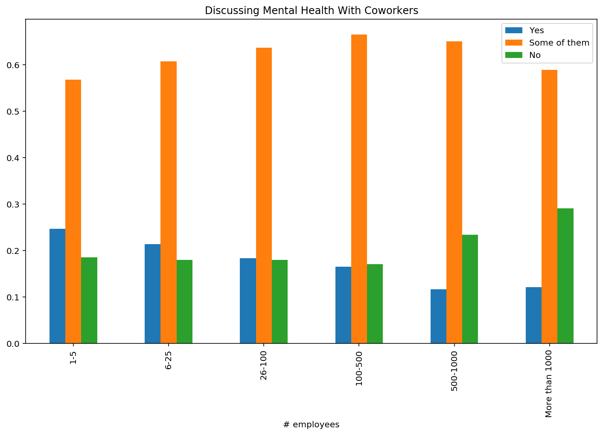

```python
import pandas as pd
import plotly.express as px
from matplotlib import pyplot as plt
import numpy as np

```


```python
survey = pd.read_csv('./survey.csv')
grape = pd.DataFrame({'num employees': ["1-5", "6-25", "26-100", "100-500", "500-1000", "1000<"], 'yes': [91, 128, 150, 95, 27, 146], 'no': [71, 162, 139, 81, 33, 136]})

# Would talking about mental health with employer have negative consequences

num_vs_mentalhealth = survey[['no_employees', 'mental_health_consequence']]

vals = num_vs_mentalhealth.value_counts()

no_employees_col = []
yes_col = []
no_col = []
maybe_col = []

for col in ['1-5','6-25', '26-100', '100-500', '500-1000', 'More than 1000']:
    no_employees_col.append(col)
    try:
        yes_col.append(vals[col]['Yes'])
    except:
        yes_col.append(0)

    try:
        no_col.append(vals[col]['No'])
    except:
        no_col.append(0)

    try:
        maybe_col.append(vals[col]['Maybe'])
    except:
        maybe_col.append(0)

mentalhealth_data = pd.DataFrame({'# employees':no_employees_col, 'Yes':yes_col, 'No':no_col, 'Maybe':maybe_col})

mentalhealth_data[['Yes', 'No', 'Maybe']] = mentalhealth_data[['Yes', 'No','Maybe']].div(mentalhealth_data.sum(axis=1), axis=0)

# Employer provide mental health resources
num_vs_seek = survey[['no_employees', 'seek_help']]

vals = num_vs_seek.value_counts()

emp = []
fix = []
big = []
wide = []

for col in ['1-5', '6-25', '26-100', '100-500',  '500-1000', 'More than 1000']:
    emp.append(col)
    try:
        fix.append(vals[col]['Yes'])
    except:
        fix.append(0)

    try:
        big.append(vals[col]['No'])
    except:
        big.append(0)
        
    try:
        wide.append(vals[col]['Don\'t know'])
    except:
        wide.append(0)
        
seek_data = pd.DataFrame({'# employees': emp, 'Yes': fix, 'No': big, 'Don\'t Know': wide})

seek_data[['Yes', 'No', 'Don\'t Know']] = seek_data[['Yes', 'No', 'Don\'t Know']].div(seek_data.sum(axis=1), axis=0)

# Willingness to talk to coworkers data

num_vs_co = survey[['no_employees', 'coworkers']]

vals = num_vs_co.value_counts()

no_employees_col = []
someofthem_col = []
yes_col = []
no_col = []

for col in ['1-5', '6-25', '26-100', '100-500', '500-1000', 'More than 1000']:
    no_employees_col.append(col)
    try:
        someofthem_col.append(vals[col]['Some of them'])
    except:
        someofthem_col.append(0)

    try:
        yes_col.append(vals[col]['Yes'])
    except:
        yes_col.append(0)

    try:
        no_col.append(vals[col]['No'])
    except:
        no_col.append(0)
        
co_data = pd.DataFrame({'# employees':no_employees_col, 'Yes':yes_col, 'No':no_col, 'Some of them':someofthem_col})

co_data[['Yes', 'No', 'Some of them']] = co_data[['Yes', 'No', 'Some of them']].div(co_data.sum(axis=1), axis=0)

#Consequences from talking about mental health to coworkers

num_vs_con = survey[['no_employees', 'obs_consequence']]

vals = num_vs_seek.value_counts()

emp = []
lol = []
omg = []

for col in ['1-5', '6-25', '26-100', '100-500',  '500-1000', 'More than 1000']:
    emp.append(col)
    try:
        lol.append(vals[col]['Yes'])
    except:
        lol.append(0)

    try:
        omg.append(vals[col]['No'])
    except:
        omg.append(0)

con_data = pd.DataFrame({'# employees': emp, 'Yes': lol, 'No': omg})

con_data[['Yes', 'No']] = con_data[['Yes', 'No']].div(con_data.sum(axis=1), axis=0)

# Wellness program vs work interfere

work_wellness = survey[['wellness_program', 'work_interfere']]

vals = work_wellness.value_counts()

wellness = []
Never = []
Rarely = []
Sometimes = []
Often = []

for col in ['No', 'Yes']:

    wellness.append(col)
    try:
        Never.append(vals[col]['Never'])
    except:
        Never.append(0)

    try:
        Rarely.append(vals[col]['Rarely'])
    except:
        Rarely.append(0)
        
    try:
        Sometimes.append(vals[col]['Sometimes'])
    except:
        Sometimes.append(0)
        
    
    try:
        Often.append(vals[col]['Often'])
    except:
        Often.append(0)

work_wellness_data = pd.DataFrame({'Wellness Program':wellness, 'Never':Never, 'Rarely':Rarely, 'Sometimes':Sometimes, 'Often': Often})

work_wellness_data[['Often', 'Rarely', 'Never', 'Sometimes']] = work_wellness_data[['Often', 'Rarely', 'Never', 'Sometimes']].div(work_wellness_data.sum(axis=1), axis=0)

# Benefits provided vs work leave

ben_work = survey[['benefits', 'leave']].dropna()

vals = ben_work.value_counts()

ben = []
ve = []
se = []
sd = []
vd = []

for col in ['No', 'Yes', 'Don\'t know']:

    ben.append(col)
    try:
        ve.append(vals[col]['Very easy'])
    except:
        ve.append(0)

    try:
        se.append(vals[col]['Somewhat easy'])
    except:
        se.append(0)

    try:
        sd.append(vals[col]['Somewhat difficult'])
    except:
        sd.append(0)
     
    try:
        vd.append(vals[col]['Very difficult'])
    except:
        vd.append(0)


ben_work_count = pd.DataFrame({'Benefits': ben, 'Very easy': ve, 'Somewhat easy': se, 'Somewhat difficult': sd, 'Very difficult': vd})


ben_work_count[['Very easy', 'Somewhat easy', 'Somewhat difficult', 'Very difficult']] = ben_work_count[['Very easy', 'Somewhat easy', 'Somewhat difficult', 'Very difficult']].div(ben_work_count.sum(axis=1), axis=0)
```

    <ipython-input-35-8629b71dccc4>:34: FutureWarning:
    
    Dropping of nuisance columns in DataFrame reductions (with 'numeric_only=None') is deprecated; in a future version this will raise TypeError.  Select only valid columns before calling the reduction.
    
    <ipython-input-35-8629b71dccc4>:65: FutureWarning:
    
    Dropping of nuisance columns in DataFrame reductions (with 'numeric_only=None') is deprecated; in a future version this will raise TypeError.  Select only valid columns before calling the reduction.
    
    <ipython-input-35-8629b71dccc4>:97: FutureWarning:
    
    Dropping of nuisance columns in DataFrame reductions (with 'numeric_only=None') is deprecated; in a future version this will raise TypeError.  Select only valid columns before calling the reduction.
    
    <ipython-input-35-8629b71dccc4>:123: FutureWarning:
    
    Dropping of nuisance columns in DataFrame reductions (with 'numeric_only=None') is deprecated; in a future version this will raise TypeError.  Select only valid columns before calling the reduction.
    
    <ipython-input-35-8629b71dccc4>:163: FutureWarning:
    
    Dropping of nuisance columns in DataFrame reductions (with 'numeric_only=None') is deprecated; in a future version this will raise TypeError.  Select only valid columns before calling the reduction.
    
    <ipython-input-35-8629b71dccc4>:204: FutureWarning:
    
    Dropping of nuisance columns in DataFrame reductions (with 'numeric_only=None') is deprecated; in a future version this will raise TypeError.  Select only valid columns before calling the reduction.
    
    

### Company Treatment of Mental Health in the Tech Workplace

This data study is centered on the question: How does company size affect the treatment of mental health in the tech workplace, and are larger or smaller companies better in treating employees' mental health? We hypothesized that company size greatly affects the treatment of mental health, and that employees in larger companies are treated better in terms of their mental health than those in smaller companies. We analyzed a collection of datasets and how they were affected by company size \(1–5, 6–25, 26–100, 100–500, 500–1000 employees\) and created visuals from them; these visuals compared the company size to aspects, such as mental health resources, how willing were employees to discuss mental health with their employer or supervisors, and how much mental health benefits were being provided. These datasets were taken from
the Kaggle dataset "Mental Health in Tech Survey," in which survey data was collected in 2014.

From the data and visuals, we concluded that company size does greatly affect the treatment of mental health in the workplace, and that larger companies have significantly higher regard to their employees' mental health, compared to smaller companies. Ultimately from this analysis, we hope to show people another aspect to consider in looking for a job, and how company size can most likely help determine their overall experience in the tech workplace.


```python
grape.plot(x="num employees", y=['yes', 'no'], kind='bar', title='Company Size vs. Mental Health Treatment')
plt.show()
```


    

    


From the visual above, seeking treatment for a mental health condition from employees from various sized companies is fairly consistent across the board; thus, it is unclear and not possible to draw any firm conclusions from this data. This data tells us that there may not be a correlation between the size of the company and the type of employee who would seek out mental health treatment. So, this could possibly tell us that the decision to seek treatment is more up to the person themselves rather than depending on the company's impact. 


```python
mentalhealth_data.plot(x='# employees', y=['Yes', 'Maybe', 'No'], kind='bar', title='Would talking about mental health with employer have negative consequences?')
```


    <matplotlib.axes._subplots.AxesSubplot at 0x7f86867326a0>


    

    


In general, perspectives on discussing mental health difficulties in one's workplace are divided. Some people worry that disclosing their mental health to their workplace will have a detrimental effect; others don't think it will, and some are not sure. According to the graph above, businesses with staff populations of 1–5, 6\-25, and 26–100 think they would not suffer consequences if they talked about mental health. Companies with populations of 100\-500, 500\-1000, and greater than 1000 think that talking about mental health might have any negative effects. From this data, it looks like employees from bigger companies fear talking about mental health because they feel like it could lead to negative consequences. So, smaller companies are much more willing to talk about mental health. Mental health is way less stigmatized and is much more accepted in the workplace. No company of any size has a majority who believe that discussing mental health will have negative consequences. Progress has been made, but more needs to be done so that everyone feels safe discussing mental health issues. 


```python
seek_data.plot(x='# employees', y=['Yes','Don\'t Know', 'No'], kind='bar', title='Does Employer Provide Resources or Help Mental Health Issues?')
```


    <matplotlib.axes._subplots.AxesSubplot at 0x7f4a533a17f0>


    

    


The visual above shows the data behind the question, "Does your employer provide resources to learn more about mental health issues and how to seek help?" There is a very clear answer to this question. There is a clear pattern in the image above. As the number of employees increases, the number of "No" decreases, the number of "Don't Know'" increases, and the number of "Yes" increases. So, this tells us that bigger companies are more accepting about talking about mental health and have more resources to help their employees compared to smaller companies. Smaller companies are more scared of losing employees, especially since their margins are smaller. They might have a fear that their employees will leave because of issues with mental health, which they would want to avoid. 


```python

# Creating dataset
lbls = ['1-5 (21)', '6-25 (25)', '26-100 (33)',
        '100-500 (31)', '500-100 (17)', '>1000 (123)']

data = [21, 25, 33, 31, 17, 123]


# Creating plot
fig = plt.figure(figsize =(15, 12))
plt.pie(data, labels = lbls)


# plot title
plt.title('YES Wellness Program')

# show plot
plt.show()
```


    

    


The image makes it quite evident that larger companies—those with more than 1000 employees—are far more likely to have wellness programs than companies with fewer than 1000 employees. In comparison to smaller companies, larger companies have significantly more funding and resources to offer their employees wellness and mental health initiatives.  They also have more employees, which increases the likelihood that more people have mental health problems. As a result, they are more likely to implement a wellness program because a higher proportion of people could benefit from it. All employees benefit when companies support and promote mental health for those who are suffering and those who are just not thriving.


```python
lbls = ['1-5 (117)', '6-25 (201)', '26-100 (171)',
        '100-500 (84)', '500-100 (18)', '>1000 (55)']
data = [177, 201, 171, 84, 18, 55]
fig = plt.figure(figsize =(15, 12))
plt.pie(data, labels = lbls)

# plot title
plt.title('NO Wellness Program')

# show plot
plt.show()
```


    

    


This image directly corresponds to the one before it, supporting our theory. In the visual before this, we were able to see which sized companies have wellness programs, and it was obvious that larger businesses with more than 1000 employees made up the vast bulk of those. Now that we have a closer look at this graphic, we can see that the three smallest\-sized businesses in the survey make up the largest portions of the pie chart that shows the lack of a wellness program. As I said before, smaller companies don’t typically have the deep pockets of larger corporations. Large companies can “afford” to implement an employee mental health program. It would simply be too expensive for small business owners. For every amount of “downtime” an employee needs or takes, that’s lost revenue and growth for a company that is still in its starting stages and needs to grow to survive.


```python
con_data.plot(x='# employees', y=['Yes', 'No'], kind='bar', title='Consequences From Talking About Mental Health to Coworkers')


```


    <matplotlib.axes._subplots.AxesSubplot at 0x7f8686feed90>


    

    


This bar graph displays how company size affects the response to "Do you think that discussing a mental health issue with your coworkers would have negative consequences?" to which the employees either responded "Yes" or "No." From this graph, there is a clear positive correlation between company size and employees willing to discuss a mental health issue. This does not completely support our theory that larger companies take care of their employees' mental health, but it does show how talking about mental health can pressure employees from discussing them with their coworkers.


```python
co_data.plot(x='# employees', y=['Yes','Some of them', 'No'], kind='bar', title='Discussing Mental Health With Coworkers')


```


    <matplotlib.axes._subplots.AxesSubplot at 0x7f8686fd9370>


    

    


Employees in larger companies \(i.e. more than 100\) were reported to have significantly less tendency to discuss mental health with their coworkers, than employees in smaller companies. This does not completely coincide with our theory that larger companies are taking care of their employees' mental health better, but it gives a new perspective on how peers are willing to talk to each other based on their company size, as well as their social environment.


## Conclusion

The big question is, "Are larger or smaller companies taking care of their employees' mental health better?" From all the visuals and data, we have seen, we can answer this question. Larger companies are taking care of their employee's mental health problems better than smaller companies. Larger companies provide many resources, have programs that are able to help their employees, and are more willing to talk about mental health. Work gets stressful. What makes the difference in keeping employees healthy: feeling supported. Big corporations have benefits and make it acceptable for employees to focus on their mental health, by attending therapy or encouraging seeking treatment. This is because losing an employee for some time doesn't have as much of an impact as it would have on a smaller company. Regrettably, small businesses often lack the financial resources or infrastructure to support employees’ mental health and work\-life balance. This vulnerability, coupled with the COVID\-19 pandemic, has had a profound and negative impact, leading to substantial layoffs and financial fragility. Smaller companies do not have extra resources to devote to mental health programs.

Overall, larger companies are doing a pretty good job supporting their employees' mental health. Smaller companies are making an effort, but it is understandably much harder for them to implement mental health programs and resources for their employees. Hopefully, in the near future, all companies have mental health programs and resources available for their employees!


### We want to see the effects of companies' attitudes toward people with mental health illnesses

A survey on mental health in the tech workplace was conducted in the year of 2014. This survey asked a multitude of questions ranging from the participant's family history of mental illnesses, to whether or not they feel safe and comfortable with talking to their supervisor about their mental health conditions. From this large dataset, our group separated the survey results into five separate visuals: wellness programs at work vs how often mental health affects your work, any treatment done vs seeking help, anonymity vs any observed consequences from the mental health conditions, whether or not you're willing to talk to your supervisor about your mental health
and seeking help, and if the company provides benefits vs how easy it is to take a leave due to mental health.

From the visuals we have created, we were able to explore more and understand in more detail about mental health in the workplace and concluded that mental health is impacting employees at work, and that if companies provide solutions and programs to help with the mental health conditions, employees will use them to improve their health and
experience at work.


```python
work_wellness_data.plot(x= 'Wellness Program', y=['Never', 'Rarely', 'Sometimes', 'Often'], kind='bar', title='Wellness Program at Work vs. How Often Mental Health Affects Your Work')
```


    <matplotlib.axes._subplots.AxesSubplot at 0x7f86872e4100>


    

    


This is a visual showing that even though mental health conditions are interfering with employees at work, there's about the same number of companies with no solutions in a wellness program as there are companies with a wellness program to help alleviate the mental health conditions. This visual is important because the majority of the people in the survey stated that their work will at least somewhat be impacted by mental health. 


```python
import plotly.express as px
df = survey

fig = px.pie(df,
             values=[323,323,197,166,148,102],
             names=
             ['Not told to seek treatment, did not seek treatment',
              'Not told to seek treatment, did seek treatment',
              'Did not remember being told to seek treatment, did not seek treatment',
              'Did not remember being told to seek treatment, did seek treatment',
              'Told to seek treatment, did seek treatment',
              'Told to seek treatment, did not seek treatment'],
             title='Treatment vs. Seeking Help')

fig.show()
```


This visual shows that more than half of employees working in a company are not provided resources to learn more about mental health issues and how to seek help. However, we can see that with the employees that were provided resources, a higher percentage of them sought treatment compared to those who did not. This is important because this shows that employees will use the resources provided to them by the company to try to seek help and learn more about mental health issues. 


```python
import plotly.express as px
df = survey


fig = px.pie(df,
             values=[317, 58, 40, 25, 718, 101],
             names=
             ['Anonymity was protected, no known consequences for mental health',
              'Anonymity was protected, known consequences for mental health',
              'Anonymity was not protected, no known consequences for mental health',
              'Anonymity was not protected, known consequences for mental health',
              'Don\'t know if anonymity was protected, no known consequences for mental health',
              'Don\'t know if anonymity was protected, known consequences for mental health'],
             title='Anonymity vs. Observed Consequences')

fig.show()
```


This pie chart shows how employees being kept anonymous can affect if they have any observed mental health consequences. 57% of the respondents said that they did not know if their anonymity was protected, but they did not have any known consequences for mental health. 25.2% of respondents said that they knew they were kept anonymous, and they did not have any consequences for mental health.


```python
import plotly.express as px
df = survey

fig = px.pie(df,
             values=[247, 226, 173, 140, 129, 113, 110, 67, 54],
             names=
             ['Willing to discuss mental health with supervisor, employer doesn\'t provide resources for how to seek help',
              'Not willing to discuss mental health with supervisor, employer doesn\'t provide resources for how to seek help',
              'Willing to discuss mental health with some supervisors, employer doesn\'t provide resources for how to seek help',
              'Willing to discuss mental health with supervisor, doesn\'t know if employer provides resources for how to seek help',
              'Willing to discuss mental health with supervisor, employer provides resources for how to seek help',
              'Not willing to discuss mental health with supervisor, doesn\'t know if employer provides resources for how to seek help',
              'Willing to discuss mental health with some supervisors, doesn\'t know if employer provides resources for how to seek help',
              'Willing to discuss mental health with some supervisors, employer provides resources for how to seek help',
              'Not willing to discuss mental health with supervisor, employer provides resources for how to seek help',],
             title='Supervisor vs. Seeking Help')

fig.show()
```


The relationship between employees, supervisors, and employers is shown. Over 50% of employers do not provide resources on seeking help for mental illness, and only 20% of tech employees with mental illnesses are provided with resources. 


```python
ben_work_count.plot(x='Benefits', y=['Very easy', 'Somewhat easy', 'Somewhat difficult', 'Very difficult'], kind='bar', title='Does the Company Provide Benefits vs. How Easy it is to Take Leave for Mental Health')

```


    <matplotlib.axes._subplots.AxesSubplot at 0x7f8687022a60>


    

    


This bar graph shows how easy it is to take leave depending on whether or not you have benefits. While some employees don't know whether or not they have benefits set up for them if they have mental health issues, it is clear that there is somewhat of a correlation between not being able to take leave for mental health issues and companies not offering benefits for mental health\-related issues. When the companies do provide benefits, it is significantly easier to take leave for mental health, than when the companies do not provide benefits at all.


### Conclusion


From many comparisons of survey results from tech employees, we have tried to find the effects of different company's attitudes towards people with mental health illnesses. We have found that there seems to be a lack of mental health awareness and proper work 
accommodations such as benefits, leave, anonymity, and other resources, but above that, there seems to be people that feel that they cannot talk to their supervisors or think that they will receive negative consequences for admitting to having bad mental health. However, these feelings seem to be tied to not having access to those resources that were previously mentioned. After taking a close look at these statistics
it is evident that tech companys need to take into consideration the mental health resources they provide and try to better those resources for the sake of their employees.


